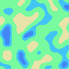
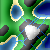
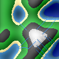
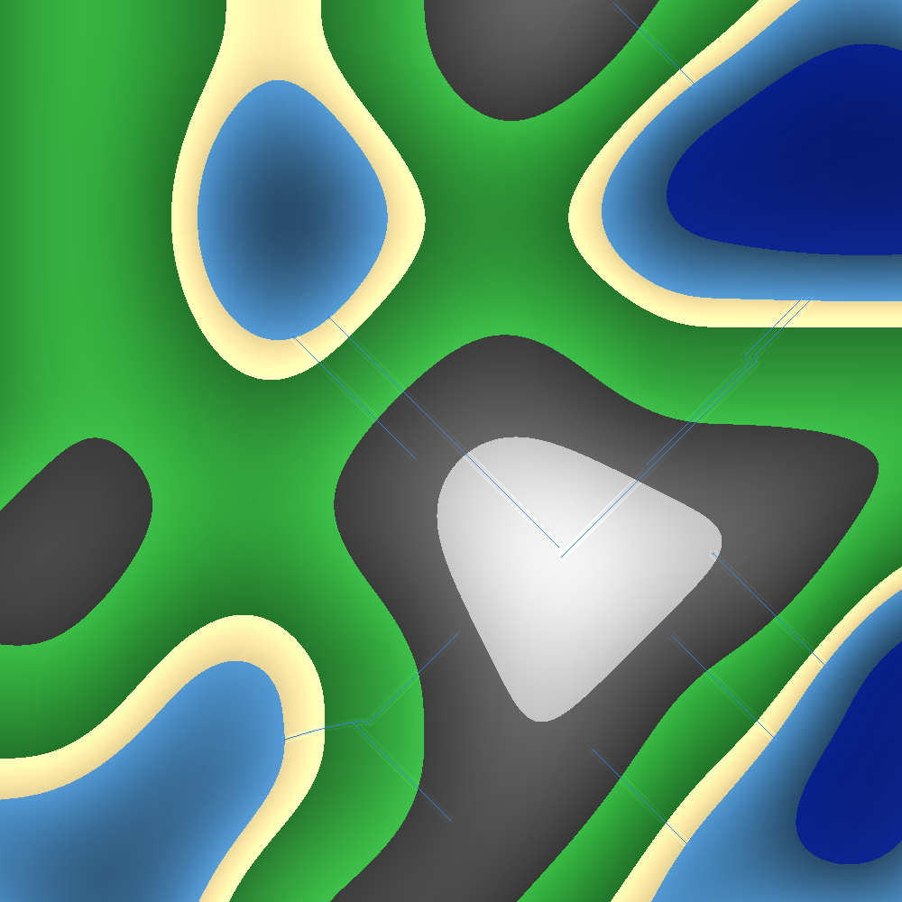
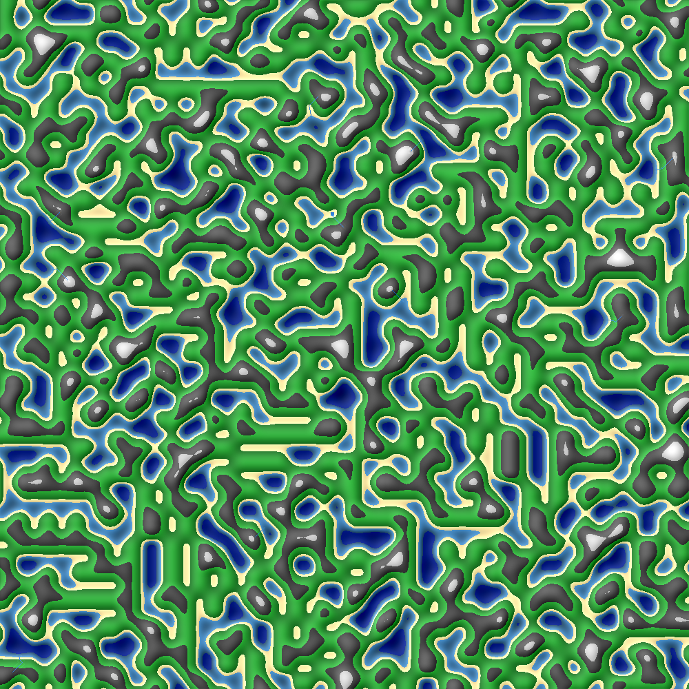

# Python Procedural World Generator



This repository contains another one of my late night side projects.

This time, I decided to delve into the not-so-mysterious territory of procedural world generation.

Do I have a reason? Nope.
Do I need one? Most likely.
Will I come up with one? We'll see.

I'm happy to take suggestions or constructive criticism of my work, because I know that it's definitely not perfect in the slightest.

I am aware that the code for this is a mess at the moment, I did write it in the middle of the night after all. My plan next is to completely rewrite the whole thing so that it'll be easier to maintain moving forward.

## Future Direction
This project started out as a quick experiment, but I'm finding myself genuinely interested in expanding this into something more interactive. Whether that is a small simulation, or a game using PyGame. I have no clue, but I definitely will be coming back again

## Features
- [x] Procedurally generated terrain using Perlin noise
- [x] Terrain generation based on height
- [x] River generation with basic merging and very simple lake generation
- [x] Terrain shading based on elevation
- [x] Extremely simplified lighting model which also have the cool side effect of looking like there's shadows!!

## Planned Features
I have some ideas of what I want to do, but if you have a suggestion, open an issue to say what you want added, and I'll give it a go!

My ideas:
- [ ] Biomes - Currently everything just looks very same-y and I don't quite like it. I want to add things like deserts and forests. Just to give it something nicer to look at.

- [ ] World decorations - Trees in grasslands, rocks in the mountains. Simple things like that. I think it would make the world look an awful lot nicer and way more alive.

- [ ] Villages - I want to add in villages that will appear near to water or rivers. In my head these will all be unique to an extent, too.

- [ ] Fix Rivers - I think it's rather obvious that they don't look great yet. I like they way they're working conceptually, where they attempt to merge with each other when they're close enough, and they'll try to curve to the nearest body of water. But I don't like the fact that they're just straight lines. I want to make them look more like real rivers if possible.

- [ ] Fog (and other atmospheric effects) - Because currently the world is just plain and boring. If I make higher up points slightly obscured (I have no idea what I mean by that yet), then it would look like it's foggy/cloudy higher up. It might look good, it might look terrible. Only one way to find out

- [ ] 3D? - Likely will never ever ever happen, but I for some reason really want to make this into a 3D thing that you can navigate. Is it worth it, though? Again, I have no idea

- [ ] Gameplay - Currently all this does is spit out the map into a png, but I want to have this running in PyGame, with non-player-characters (I don't like calling them NPCs, it just sounds silly) which roam free throughout the land that you can interact with. Question: What does the gameplay look like? Answer: Stop asking questions as if I've put that much thought into it. Do you really think I had put any amount of thought into it before I started writing? No!

## How to run
1. Clone the repository:
```bash
git clone https://github.com/Owen7000/Python-Procedural-World-Generator.git
cd Python-Procedural-World-Generator
```

2. Install dependencies
```bash
pip install -r "requirements.txt"
```

Or, if you feel like doing things the boring way

```bash
pip install noise pillow
```

3. Run
```bash
python main.py
```

4. Check the output
The generated map will be saved as `output.png`

## Examples
This section contains examples that I think are cool or worth showing. I might be generous enough to add text to describe them, but likely will not.

---

These first three images show the same section of the map, in three different resolutions. Each one multiplies the height/width and the scale by the same amount. This way it is always the same part of the map. You can notice that the rivers are different each time. This is because they are not deterministic.







---

This last image shows a 1000px by 1000px example which I have a scale of 40 applied to. This means it is roughly the same visual scale as the second example image. Just with an extra 100x the map generated.
